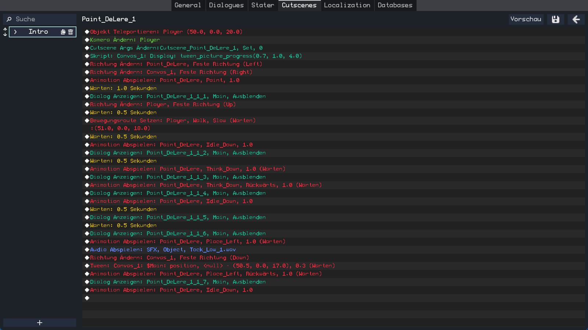
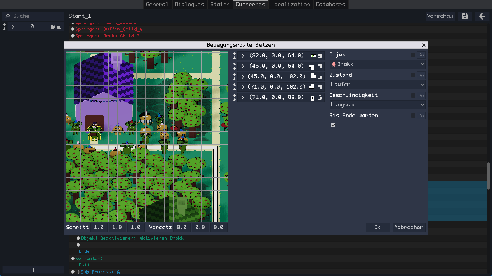
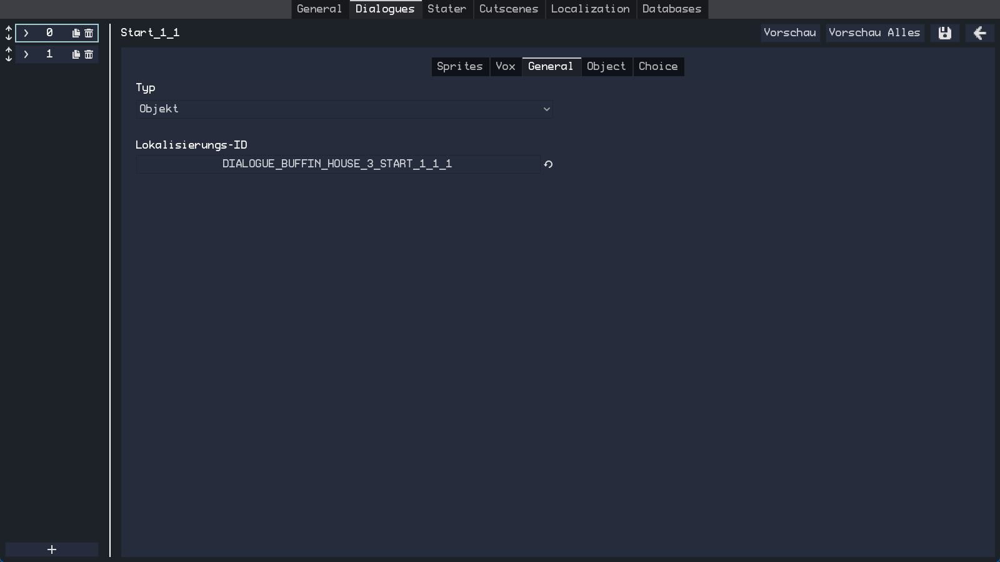
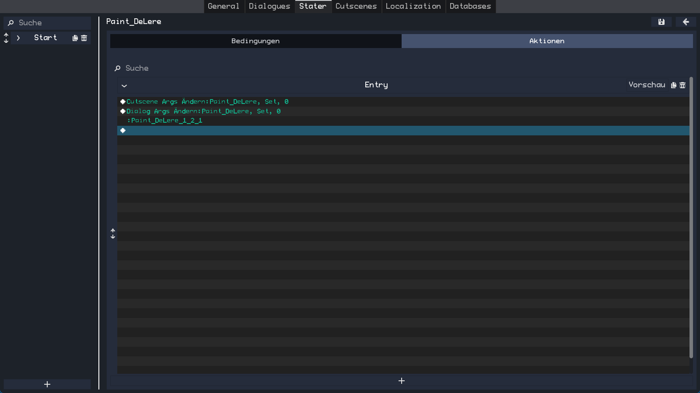
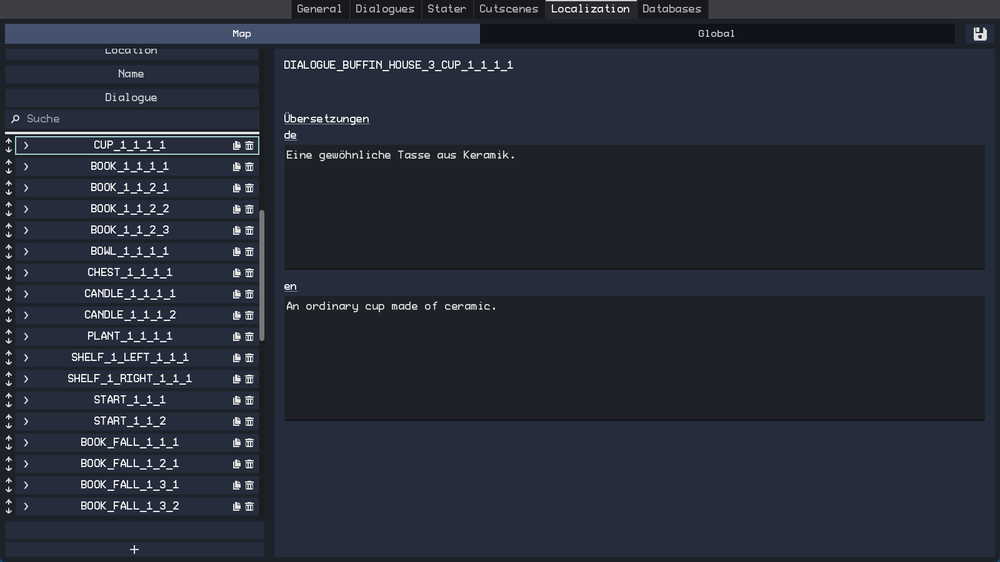

# RPG Framework
This is a framework that was created to lower the effort to develop specifically RPG games. It features a lot of extendable and flexible systems that are needed in almost any (RPG) game. It works in 2D and 3D while sharing most of the code.

<ul>
    <li>Cutscene-, Dialogue- and State-Editor</li>
    <li>Localization-Editor</li>
    <li>Cutscene System</li>
    <li>Dialogue System</li>
    <li>Inventory System</li>
    <li>Side-View Battle System</li>
    <li>Equipables System</li>
    <li>Value-Editor</li>
    <li>Audio Manager</li>
    <li>Scene Manager</li>
    <li>Title Screen</li>
    <li>Main Menu</li>
    <li>Saving and Loading</li>
    <li>Plenty of Object-Components</li>
    <li>Value-Editor</li>
    <li>Versioning and save file validation</li>
    <li>... and more</li>
</ul>

### Cutscene-Editor

Offers a rich set of commands that are executed subsequentually to create any cutscene imaginable. Each command features a preview that represents the current state of the scene before the command is executed. Here are some of the available commands:
<ul>
    <li>Set Move Route</li>
    <li>Tween</li>
    <li>Play Animation</li>
    <li>Move Free Camera</li>
    <li>Conditional Branch</li>
    <li>Loop</li>
    <li>Sub-Process</li>
    <li>Change Equipables</li>
    <li>Wait</li>
    <li>Play Audio</li>
    <li>Script</li>
    <li>Show Dialogue</li>
</ul>

### Dialogue-Editor

Transforms your Localization IDs into Text-, Info- or Choice dialogues. It allows you to specify Sprites, Vox, Choices and the Object belonging to the text. These dialogues can then be used within the Cutscene-System or displayed individually.

### State-Editor

Set the state of objects by specifying actions that are executed when certain conditions are fulfilled. The actions use the Cutscene-Editor to change the state of objects.

### Localization-Editor

Add, Edit or Delete Localization IDs. Translate your game in a well-organized manner.